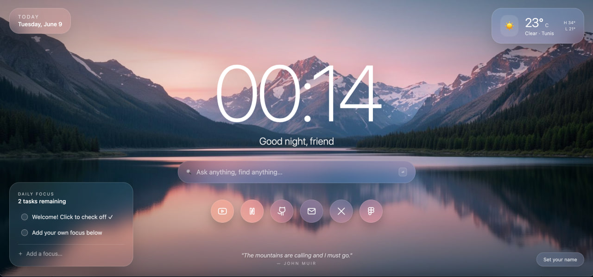

# Glassmorphism New Tab



> A personalized Chrome/Brave new tab dashboard with a polished glassmorphism interface, scenic background, live weather, quick links, search, and daily focus tools.

## Overview

**Glassmorphism New Tab** transforms the default browser new tab page into a calm, modern dashboard built around translucent panels, soft blur, layered depth, and elegant motion. The interface blends a scenic background with frosted-glass UI elements to create a workspace that feels minimal, functional, and visually refined.

Built as a **Manifest V3 Chrome Extension**, it runs locally in the browser with no external CDNs, keeping the experience fast, private, and extension-safe.

## Features

- 🕰️ **Dynamic digital clock** with a personalized greeting.
- 🔍 **Functional Google search bar** for quick web searches.
- ☁️ **Live weather widget** powered by the Geolocation API and Open-Meteo.
- ✅ **Daily Focus / To-Do list** with `localStorage` persistence.
- 🔗 **Quick links** with smooth glass hover animations and inline SVG icons.
- 🔒 **Fully local and secure** with Manifest V3 compliance and no external CDN dependencies.
- 🖼️ **Scenic glassmorphism design** with frosted panels, subtle shadows, and soft contrast.

## Installation Guide

Follow these steps to load the extension locally in Chrome or Brave:

1. Download or clone this repository.

   ```bash
   git clone https://github.com/oussemanaffetyy/glassmorphism-new-tab.git
   ```

2. Open your browser extensions page.

   - Chrome: `chrome://extensions`
   - Brave: `brave://extensions`

3. Enable **Developer mode** using the toggle in the top-right corner.

4. Click **Load unpacked**.

5. Select the project folder:

   ```text
   glassmorphism-new-tab
   ```

6. Open a new tab and enjoy your glassmorphism dashboard.

## Weather Permission

The weather widget uses the browser's Geolocation API to detect your approximate location. If location access is denied, the extension falls back to a default city so the widget remains functional.

You can reset or update location access from your browser's site/extension permission settings.

## Tech Stack

- **HTML5** for the extension structure.
- **Tailwind CSS** compiled locally for utility-first styling without CDN usage.
- **Vanilla JavaScript** for clock, greeting, search, weather, quick links, and to-do behavior.
- **Chrome Extension Manifest V3** for secure browser extension support.
- **Open-Meteo API** for live weather data.
- **Inline SVG icons** to avoid CSP issues from external icon fonts.

## Project Structure

```text
glassmorphism-new-tab/
├── assets/
│   ├── bg-scenic.jpg
│   └── photo_2026-06-09_00-14-38.jpg
├── icons/
│   └── icon-128.png
├── manifest.json
├── newtab.css
├── newtab.html
├── newtab.js
├── tailwind.css
└── README.md
```

## Security & Privacy

- No external CDNs are loaded.
- User preferences and daily focus items are stored locally with `localStorage`.
- The extension follows Manifest V3 requirements.
- Weather data is fetched only from Open-Meteo endpoints declared in `manifest.json`.

## Credits

Crafted by **OUSSEMA NAFFETI**.
